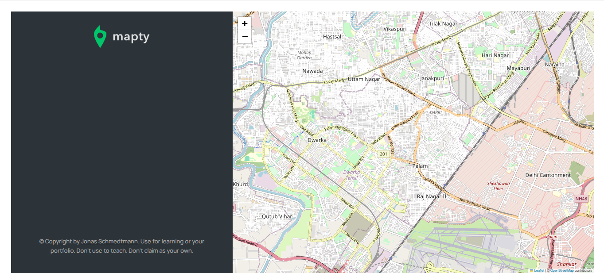
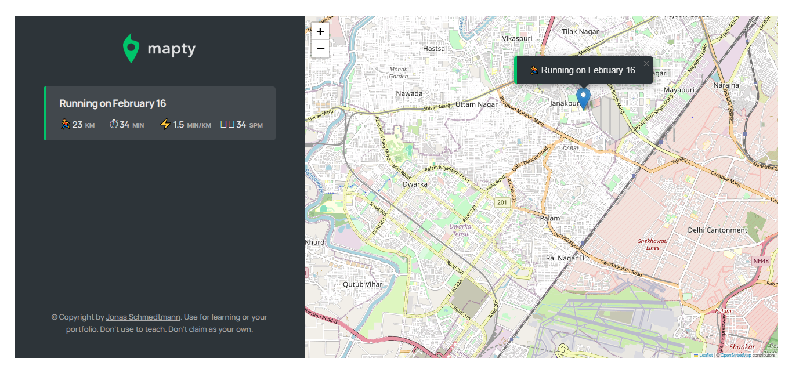

# Mapty - Workout Tracking Application

Mapty is an interactive workout tracking application that allows users to log and visualize their running and cycling activities on a map. Built with modern JavaScript and Leaflet.js, Mapty provides an intuitive interface for tracking fitness progress.

## Features

- **Interactive Map**: Visualize your workouts on a map using Leaflet.js
- **Workout Logging**: Log running and cycling activities with detailed metrics
- **Persistent Storage**: Workouts are saved in local storage for continuity
- **Geolocation**: Automatically centers map on user's location

## Installation

1. Clone the repository:
   ```bash
   git clone https://github.com/Jatinsharma43/mapty.git
   ```
2. Navigate to the project directory:
   ```bash
   cd mapty-project
   ```
3. Open the application:
   - Open `14.html` in your browser
   - Or use a live server extension in your code editor

## Usage

1. **Start Tracking**:

   - Click on the map to add a workout at that location
   - Select workout type (Running or Cycling)
   - Enter workout details (distance, duration, etc.)

2. **View Workouts**:

   - Workouts appear as markers on the map
   - Detailed workout information is displayed in the sidebar

3. **Persistent Data**:
   - Workouts are automatically saved in your browser
   - Data persists even after closing and reopening the app

## Technologies Used

- JavaScript (ES6+)
- Leaflet.js (Mapping library)
- HTML5 & CSS3
- Web Geolocation API
- Local Storage API

## Screnshots




## Contributing

Contributions are welcome! Please follow these steps:

1. Fork the repository
2. Create your feature branch (`git checkout -b feature/AmazingFeature`)
3. Commit your changes (`git commit -m 'Add some AmazingFeature'`)
4. Push to the branch (`git push origin feature/AmazingFeature`)
5. Open a Pull Request

## Acknowledgments

- Inspired by Jonas Schmedtmann's JavaScript course
- Leaflet.js for the mapping functionality
- OpenStreetMap for the map data
